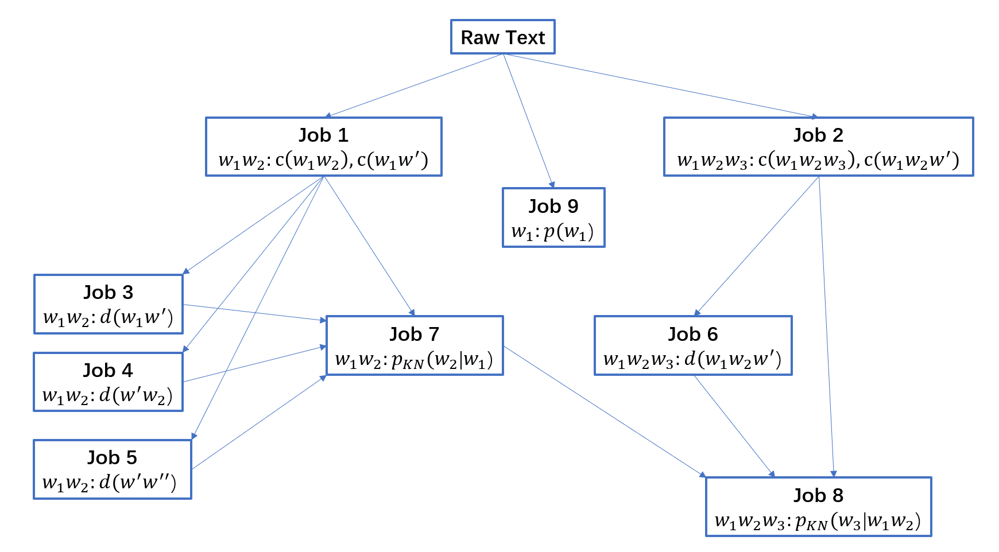

# Kneser-Ney by MapReduce

## 1 简介

本项目使用 Hadoop MapReduce 框架对中文语料中的 trigram 出现频率进行了统计，在此基础上实现了 Kneser-Ney 的插值平滑算法。利用上面计算所得到的数据，结合数据库可进行汉字输入预测和语句概率计算。

## 2 背景与思路

在马尔科夫假设下，可以利用 N-Gram 语言模型这种较为简单的方法进行较好的预测，且 N 的维度升高时效果还可能变得更好。遗憾的是，在高维的模型中，需要的样本容量和计算量都十分巨大，且很容易遇到某些 N-Gram 不出现的情况。

### $P(w_1^n) = P(w_1)P(w_2|w_1)P(w_3|w_1^2)...P(w_n|w_{n-2}^{n-1})$

( $w_i^j$ 表示从第 i 个字开始到第 j 个字为止的子串)

面对这样巨大的计算任务，我们可以利用 MapReduce 框架进行伸缩性良好的大规模并行计算。针对某些 N-Gram 不出现的情况，我们不能简单地将它的概率预测为0，而是可以通过一些平滑方法对概率进行合理的估计。

在众多平滑算法中，Kneser-Ney 的表现较好。事实上，根据 S. F. Chen and J. Goodman 的实验结果，在与其它常见的平滑算法(Jelinek-Mercer, Katz, Witten-Bell 等)的比较中，Kneser-Ney 的表现是最好的。基于 Kneser-Ney 的算法有多种具体实现方式，这里选择了其中一种插值的方法。

Kneser-Ney 可以说是基于 Absolute Discounting 的改进。在 Absolute Discounting 中，通过在已出现词语计数的基础上减去一个固定值$\delta$，来为未出现词语留出概率空间。未出现词语的频率通过这种方式计算后与其低阶元频率成正比，例如对于一个未出现过的二元组 $w_{i-1}^{i}$，预测相应的条件概率：

###  $p_{AD}(w_i|w_{i-1}) = \lambda_{w_{i-1}} p(w_{i})$

但是仅仅通过 $p(w_{i})$ 就来估计 $p(w_i|w_{i-1})$ 显然是草率的：因为有些 $w_i$ 虽然在全文出现的频率高，但是往往是以某个固定的词的形式，如"咖啡"中的后缀 "啡"，出现的频率虽高却不太可能出现在别的词中。因此在 Kneser-Ney 中提出了需要考虑一个字**作为后缀出现的频率**，而不是该单字在文中出现的绝对频率。记 $c(w_i, w_j)$ 为词语 $w_iw_j$ 的出现次数，则对于未出现过的词语 $w_{i-1}w_{i}$，其条件概率估计为：

### $p_{KN}(w_i|w_{i-1}) = \lambda_{w_{i-1}} \frac{|\{w' : 0 < c(w', w_i)\}|}{|\{(w', w'') : 0 < c(w', w'')\}|}$

其中 $\lambda_{w_{i-1}}$ 是一个归一化常数，用于将概率之和归一，在这里我们略去证明过程，给出该常数的一种实现形式：

### $\lambda_{w_{i-1}} = \delta\frac{|\{w' : 0 < c(w_{i-1},w')\}|}{\sum_{w'}c(w_{i-1}, w')}$

以上公式加上已出现词语的情况，可以给出对于 bigrams 计算 Kneser-Ney 概率的一般形式：

### $p_{KN}(w_i|w_{i-1}) = \frac{max(c(w_{i-1}, w_i) - \delta, 0)}{\sum_{w'}c(w_{i-1}, w')} + \delta\frac{|\{w' : 0 < c(w_{i-1},w')\}|}{\sum_{w'}c(w_{i-1}, w')} \times \frac{|\{w' : 0 < c(w', w_i)\}|}{|\{(w', w'') : 0 < c(w', w'')\}|} \ \ \ \  (*)$

拓展到 trigrams ，则有类似的以下形式：

### $p_{KN}(w_i|w_{i-2}^{i-1}) = \frac{max(c(w_{i-2}^{i-1}, w_i) - \delta, 0)}{\sum_{w'}c(w_{i-2}^{i-1}, w')} + \delta\frac{|\{w' : 0 < c(w_{i-2}^{i-1},w')\}|}{\sum_{w'}c(w_{i-2}^{i-1}, w')}p_{KN}(w_i|w_{i-1}) \ \ \ \  (**)$

## 3 计算方法

我们的主要任务是通过 Hadoop MapReduce 框架从原始语料直接计算出上面的 $p_{KN}(w_i|w_{i-2}^{i-1})$ ，由于公式较为复杂，需要拆分成若干个 job 完成，其中一些步骤的中间结果也是有价值的。由于样本空间过大，不可能也没必要穷举所有三元组，在 MapReduce 中只计算出现过的 trigram 对应的条件概率 $p_{KN}(w_i|w_{i-2}^{i-1})$，未出现的可以在需要时在前端进行现场计算。

------

为了简化表示形式，作以下记号： 

$c(w_1w_2) := c(w_{i-1}, w_i)$

$c(w_1w') = \sum_{w'}c(w_{i-1}, w')$

$d(w_1w') := |\{w' : 0 < c(w_{i-1},w')\}|$

$d(w'w'') := |\{(w', w'') : 0 < c(w', w'')\}|$

$c(w_1w_2w_3) := c(w_{i-2}^{i-1},w_i)$

$c(w_1w_2w') := \sum_{w'}c(w_{i-2}^{i-1}, w')$

$d(w_1w_2w') := |\{w' : 0 < c(w_{i-2}^{i-1},w')\}|$

------

下图中每个 job 的输出均以 $key: value$ 的形式表示，则 $p_{KN}(w_i|w_{i-2}^{i-1})$ 的计算可以分割成以下小步骤。由于 MapReduce 框架的局限性，每个 job 只能完成一项比较简单的任务。

虽然 job 的数量很多，但其中很多进行的工作是类似的或者是特别简单的。例如 Job 1 与 Job 2 的计算方法几乎是一样的，Job 3-6 彼此之间是类似的，Job 9 则只是计算了一个简单的单字出现频率（对于计算 $p_{KN}$ 无益但在后面的句子概率计算中会用到）。限于有限的篇幅，我们将仅介绍其中最核心与典型的几个 Job。

### Job 2

在整个 job 中，输入为原始语料，需要输出的 key 为 $w_1w_2w_3$，value 为 $c(w_1w_2w_3),c(w_1w_2w')$。

在 Mapper 中，输入为原始语料，输出的 key 为 $w_1w_2$，value 为一个 map 结构，其中 map 的 key 为 $w_3$ ，value 为 1。

在 Reducer 中，对每个得到的 $w_1w_2$，遍历其所有 map ，统计每个后缀 $w_3$ 出现的次数得到 $c(w_1w_2w_3)$ ，同时计算这些次数之和得到 $c(w_1w_2w')$。

Job 1 的计算方法与此完全类似，故不再赘述。

### Job 6

在整个 job 中，输入为 Job 2 的输出，Job 6 需要输出的 key 为 $w_1w_2w_3$，value 为 $d(w_1w_2w')$。

在 Mapper 中，对来自 Job 2 的数据进行处理，输出的 key 为 $w_1w_2$，value 为 $w_3$。

在 Reducer 中，对每个 $w_1w_2$，累加其后缀 $w_3$ 的可能个数得到 $d(w_1w_2w')$。对于每个输入的 $<w_1w_2: w_3>$ 元组，输出一个元组$<w_1w_2w_3: d(w_1w_2w')>$

Job 3, Job 4, Job 5 的计算方法与此类似，只是减少了维度或者选择不同位置的字符进行统计。

### Job 7

通过 Job 1, Job 3, Job 4, Job 5 输入的数据，对每个二元组 $w_1w_2$ 计算出 Kneser-Ney 的概率估计 $p_{KN}(w_2|w_{1})$。

由于前面的 Job 已经将数据分类组织完毕，这个 Job 的 Mapper 不需要做任何操作，直接将 $<key : value>$ 元组原封不动地传给 Mapper 即可。

在 Reducer 中，对每条输入的元组进行解析。来自不同 Job 的元组内容有所不同，但基本上均遵循 $<w_1w_2: value>$ 的格式。我们维护一张 HashMap<String, long[]>，在解析输入元组的过程中填充每个 $w_1w_2$ 对应的数据项 $[c(w_1w_2), c(w_1w'), d(w_1w'), d(w'w_2), d(w'w'')]$。HashMap 填充完毕后对其进行遍历，利用表中数据通过上面的 $(*)$ 式计算每个 $w_1w_2$ 对应的 $p_{KN}(w_2|w_{1})$ 并输出。

### Job 8

通过 Job 2, Job 6, Job 7 输入的数据，对每个三元组 $w_1w_2w_3$ 计算出 Kneser-Ney 的概率估计 $p_{KN}(w_3|w_1w_2)$。

与 Job 7 的空 Mapper 不同，由于来自 Job 7 的数据不是以 $w_1w_2w_3$ 为 key（而是以 $w_1w_2$ 为 key），我们需要在 Mapper 中将输入数据进行重新组织。具体地说，就是将元组 $<w_1w_2w_3: value>$ 拆成 $<w_1w_2 : value, w_3>$，这样 Shuffling and Sorting 后 Reducer 才能对来自三方的数据根据 $w_1w_2$ 分类进行处理。

在 Reducer 中，对每条输入的元组进行解析，使用与 Job 7 中类似的方法同样得到一张 HashMap<String, long[]>，只是 HashMap 的键值为三元组 $w_1w_2w_3$，此时 $w_3$ 不是来自 Reducer 输入的 key 而是从 value 中解析出来的。根据 HashMap 中的数据和上面的 $(**)$ 式可以计算每个 $w_1w_2w_3$ 对应的 $p_{KN}(w_3|w_1w_2)$ 并输出。

至此，MapReduce 的工作已经全部完成，可以将计算结果（包括中间结果）导入至数据库中供各种应用使用。

## 4 计算结果 $p_{KN}$ 的应用场景

利用以上数据，可以结合数据库和 Python 实现简单的应用：

- 语句概率计算：给定语句，通过式 $P(w_1^n) = P(w_1)P(w_2|w_1)P(w_3|w_1^2)...P(w_n|w_{n-2}^{n-1})$ 计算其概率。当其中的某个元组在训练语料中未出现时，可以通过数据库中的数据和上面的式 $(*), (**)$ 现场计算出相应的 $p_{KN}$，避免了计算概率结果为0的情况。
- 汉字输入预测：用户输入语句，程序对下一个字输入的字进行预测。这里对 $p_{KN}(w_i|w_1^{i-1})$ 进行排序，选出概率最高的 $w_i$ 即可。当用户输入的语句前缀概率未知时（即训练集中未出现过），通过数据库中的数据和上面的式 $(*), (**)$ 现场计算出 $p_{KN}$ 。

## 5 致谢与参考文献

平滑算法对我而言是一个全新的领域，非常幸运能够在网上找到相关的介绍资料进行深入的学习。同时也非常感谢张奇老师提供的 Hadoop 集群能让我对该算法与 Hadoop 框架进行深入的实践。

- [Wikipedia: Kneser-Ney Smoothing](https://en.wikipedia.org/wiki/Kneser–Ney_smoothing)
- [foldl.me: Kneser-Ney smoothing explained](http://www.foldl.me/2014/kneser-ney-smoothing/)
- https://www.cnblogs.com/a-present/p/9457093.html
- S. F. Chen and J. Goodman, [An empirical study of smoothing techniques for language modeling](http://u.cs.biu.ac.il/~yogo/courses/mt2013/papers/chen-goodman-99.pdf)
- Bill MacCartney, [NLP Lunch Tutorial: Smoothing](https://nlp.stanford.edu/~wcmac/papers/20050421-smoothing-tutorial.pdf)